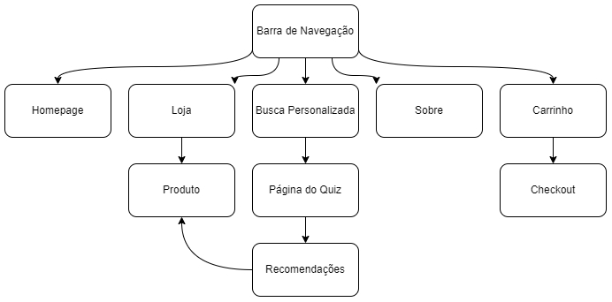

# Projeto de Web - Loja de Plantas

- Luísa Balleroni Shimabucoro - 11832385
- Matheus Bermudes Viana - 11849797
- Wictor Dalbosco Silva - 11871027

Link para teste do website hospedado: https://plant-shop-matheusbviana.vercel.app

## Requerimentos
- O sistema deve ter dois tipos de usuário:
  - *Administradores*: São responsáveis por gerenciar administradores, clientes e podutos. Para utilizar a conta de administrador, utilize as credenciais admin@admin.com:admin no formato (email:senha)
  - *Clientes*: São usuários que acessam o sistema para comprar produtos

- Para armazenar os dados é preciso ter os seguintes registros:
  - *admin*: id, nome, telefone e email
  - *cliente*: id, nome, endereço, telefone e email
  - *produto*: id, nome, foto, descrição, preço, quantidade em estoque e quantidade vendida

- Venda de produtos (ou serviços): produtos são selecionados, suas quantidades definidas e por fim são colocados no carrinho. Produtos são comprados usando um número de cartão de crédito (qualquer número é aceito pelo sistema). A quantidade do produto vendida é subtraída da quantidade do estoque e acrescida a quantidade de produtos vendidos. Carrinhos são esvaziados apenas após o pagamento ou por uma ação direta do usuário.

- Gerenciamento de produtos/serviços: administradores podem criar/atualizar/ler/deletar (CRUD) novos produtos e serviços. Por exemplo, eles podem alterar a quantidade de produtos no estoque.

- **Funcionalidade específica:** o cliente pode selecionar o tipo de residência (casa ou apartamento) e características como iluminação do cômodo, temperatura e tempo disponível para manutenção. Com isso, a aplicação oferece sugestões de plantas que cumprem pelo menos 3 dos 4 critérios.

- O sistema deve atender os requisitos de acessibilidade e prover boa usabilidade. Além disso, o sistema deve ser responsivo.


## Descrição do Projeto
Esse projeto consiste no desenvolvimento de uma aplicação online para uma loja de plantas, a qual terá as seguintes funcionalidades:
- Cadastro e Login
- Adicionar ou remover produtos do carrinho
- Processo de finalizar compra (checkout)
- Filtros de busca de produtos
- Opções para gerenciamento de clientes e produtos exclusivas para administradores do sistema
- **Funcionalidade específica:** o cliente pode selecionar o tipo de residência (casa ou apartamento) e características como iluminação do cômodo, temperatura e tempo disponível para manutenção. Com isso, a aplicação oferece sugestões de plantas que cumprem pelo menos 3 dos 4 critérios

Para que essas funcionalidades possuam um funcionamento adequado será necessário armazenar as seguintes informações:
  - *admin*: id, nome, telefone e email
  - *cliente*: id, nome, endereço, telefone e email
  - *produto geral*: id, nome, foto, descrição, preço, quantidade em estoque e quantidade vendida
    - *planta*: além dos atributos padrões, elas possuem tamanho, nível de iluminação, temperatura, manutenção ideais e categoria

### Diagrama de Navegação


<a href="https://www.figma.com/file/3dgTdFB6VzP9HX0n41i1g5/Plant-Shop-Website-(Practice-%23001)-(Community)-(Copy)?node-id=0%3A1">Projeto no Figma</a>
## Comentários Sobre o Código
## Plano de Testagem

Serão executados testes manuais para login e cadastro, inserções e gerenciamento de produtos, usuários e administradores, filtragem, busca e também simulação de compras em vários cenários.

Não serão utilizados frameworks adicionais para os testes.

Para criação de usuários admin, lembre-se de utilizar admin@admin.com:admin no formato (email:senha).

### Seguindo um roteiro de testagem

1. **Teste com cadastro**
	* Cadastro feito com e-mail inválido.
 	* Cadastro em que o campo de senha não confere com o campo de confirmação da senha.
 	* Cadastro em que a senha possua menos de 8 caracteres.
 	* Cadastro preenchido corretamente com dados válidos.
 	* Cadastro utilizando o mesmo email que o de um cadastro previamente realizado
2. **Teste com login**
    * Login feito com campos vazios.
    * Login feito com campos inválidos (email sem “@”, senha com menos que 8 caracteres etc).
    * Login feito com campos corretamente preenchidos.
    * Logout

3. **Teste com busca**
	* Busca de itens sem nenhum retorno.
	* Busca de itens com retorno.

4. **Teste com funcionalidade específica de busca personalizada**
	* Realizar busca com menos que 4 campos preenchidos.
	* Realizar busca preenchendo todos os campos de características.

5. **Teste de navegação**
	* Navegação com usuário comum.
	* Navegação com usuário admin.
 
6. **Teste com escolha de produto**
	* Visualização.

7. **Teste carrinho e check out**
	* Compra com carrinho vazio.
	* Editar quantidade de um determinado produto.
	* Remover um produto.
	* Checando a integridade dos produtos, conferindo se o produto está somente no carrinho da conta em que foi adicionado.

8. **Teste editar produto**
	* Alterar informações do produto que precisam ser mudadas e buscar pelo produto na barra de navegação.

9. **Teste inserir produto**
	* Inserir produto com campos vazios.
	* Inserir produto com campos inválidos.

10. **Teste remover produto**
	* Removendo um produto.

11. **Teste remover cliente**
	* Removendo um cliente.

12. **Teste visualizar pedidos (admin)**
	* Visualizando quais pedidos foram feitos.
		
13. **Teste visualizar compras (cliente)**
	* Cliente visualizando as compras feitas

14. **Teste visualizar produtos (admin)**
	* Administrador visualizando os produtos


## Resultado dos Testes

### Resultados esperados de acordo com o roteiro de testagem

1. Teste com cadastro
	* Alert avisando que o email é inválido e aviso do campo de texto do forms de cadastro
	* Alert avisando que as senhas não batem
	* Alert avisando que a senha deve possuir pelo menos 8 caracteres
	* Cadastro e login realizado com sucesso, dando acesso ao carrinho, aba de "Meus Pedidos" e botão de logout caso o cliente deseje sair de sua conta recém criada
	* Alert avisando que o email já foi cadastrado
3. Teste com login

## Procedimentos de Construção

Para poder testar o site é necessário ter o [Node](https://nodejs.org/en/download/) e seu gerenciador de pacotes [npm](https://nodejs.org/en/download/) instalados.

Depois de instalados, serão necessários os arquivos localizados no diretório Milestone2. Com o diretório aberto e com o comando no terminal 

```
npm install
npm start 
```

inicie o React, e aguarde a construção e abertura do servidor no navegador.

## Problemas
## Comentários

